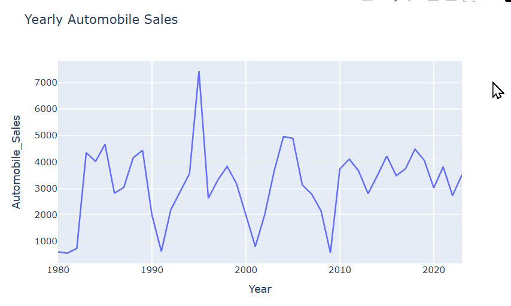
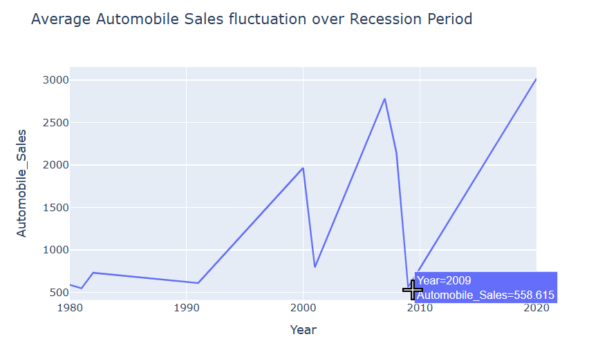
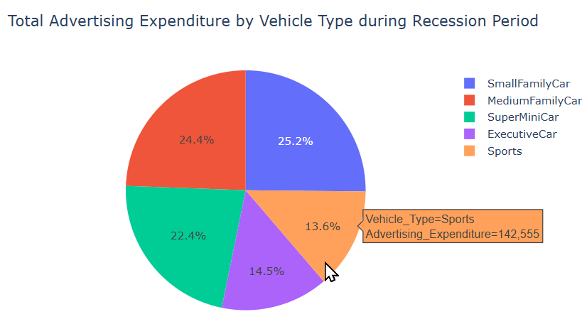
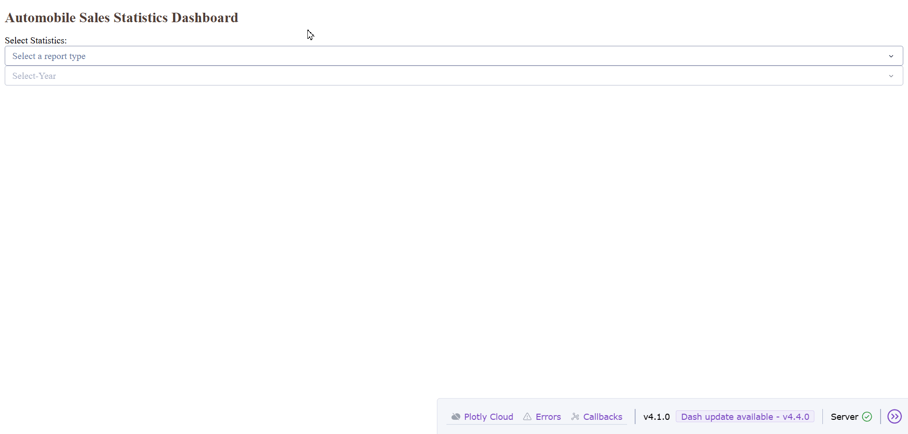
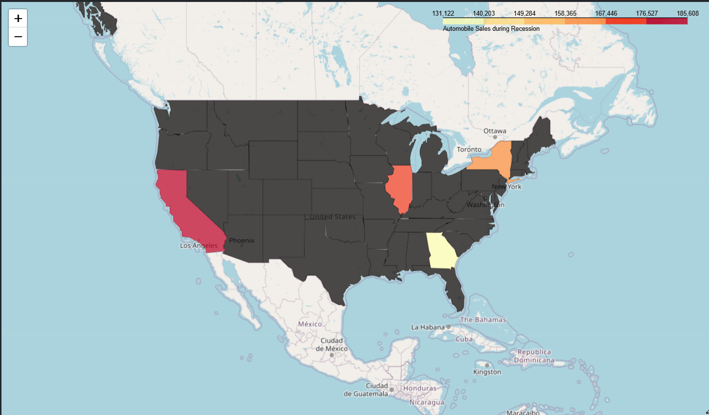

# data-visualization-project-IBM-Data-Science

## Automobile Sales Statistics Dashboard

A data visualization project built with **Python, Plotly, and Dash** to explore automobile sales trends across different years and recession periods.

This project presents an interactive dashboard where users can switch between:
- **Yearly Statistics**
- **Recession Period Statistics**

The dashboard uses historical automobile sales data to visualize trends in sales, vehicle types, advertising expenditure, and unemployment-related effects.

## Features

- Interactive **Dash web application** (Download, `DV0101EN-Final-Assign-Part-2-Questions.py`)
  - Marimo web demo, same format as the Dash app (Hosted on GitHub Pages): [Marimo Dashboard](https://this-salami.github.io/data-visualization-project-IBMDS/)
- Jupyter Notebook for data exploration, analysis, and visualization (`DV0101EN-Final-Assign-Part1-v1.jupyterlite.ipynb`, [previewable in browser](DV0101EN-Final-Assign-Part1-v1.jupyterlite.ipynb))
- Dropdown-based filtering for report type and year
- Visual analysis of:
  - Average automobile sales during recession periods
  - Average sales by vehicle type
  - Advertising expenditure share by vehicle type
  - Impact of unemployment rate on vehicle sales
  - Yearly automobile sales trends
  - Monthly automobile sales totals

## Project Structure

- `DV0101EN-Final-Assign-Part1-v1.jupyterlite.ipynb`  
  Jupyter Notebook version of the assignment/project work, covering data exploration, analysis, and visualization. 

- `DV0101EN-Final-Assign-Part-2-Questions.py`  
  Dash app script containing the interactive dashboard

- `marimo/notebook.py`  
  Marimo notebook version of the dashboard for web deployment utilizing Marimo's export capabilities and GitHub Actions for continuous deployment

- `README.md`  
  Project documentation

## Technologies Used

- Python
- Pandas
- Plotly
- Dash
- Jupyter Notebook
- Marimo (for web deployment)
- GitHub Actions (for CI/CD and deployment)

## Dataset

The project loads automobile sales data directly from an online CSV source inside the Python script.

## Dashboard Visualizations

### Recession Period Statistics
When **Recession Period Statistics** is selected, the dashboard displays:
1. Average automobile sales fluctuation over recession years
2. Average automobile sales by vehicle type during recessions
3. Total advertising expenditure by vehicle type during recessions
4. Effect of unemployment rate on vehicle type and sales

### Yearly Statistics
When **Yearly Statistics** is selected and a year is chosen, the dashboard displays:
1. Yearly automobile sales trend
2. Total monthly automobile sales
3. Average vehicles sold by vehicle type in the selected year
4. Total advertising expenditure by vehicle type in the selected year

## Dashboard (Dash) Images:

Images (static screenshots):




GIF (animated demo):


## Jupyter Notebook Images:

Map (Hidden in browser view): 


## Installation

1. Clone the repository:
   ```bash
   git clone https://github.com/this-salami/data-visualization-project-IBMDS.git
   cd data-visualization-project-IBMDS
   ```

2. Install dependencies:
   ```bash
   pip install dash pandas plotly
   ```

## How to Run

Run the dashboard locally with:

```bash
python DV0101EN-Final-Assign-Part-2-Questions.py
```

Then open your browser and go to the local Dash server address shown in the terminal, typically:

```bash
http://127.0.0.1:8050/
```

## Learning Objectives

This project demonstrates how to:
- Build interactive dashboards with Dash
- Create line, bar, and pie charts with Plotly Express
- Filter and aggregate data using Pandas
- Present business insights through visual storytelling

## Possible Improvements

- Add custom styling for a more polished UI
- Improve responsiveness for smaller screens
- Add data validation and loading indicators
